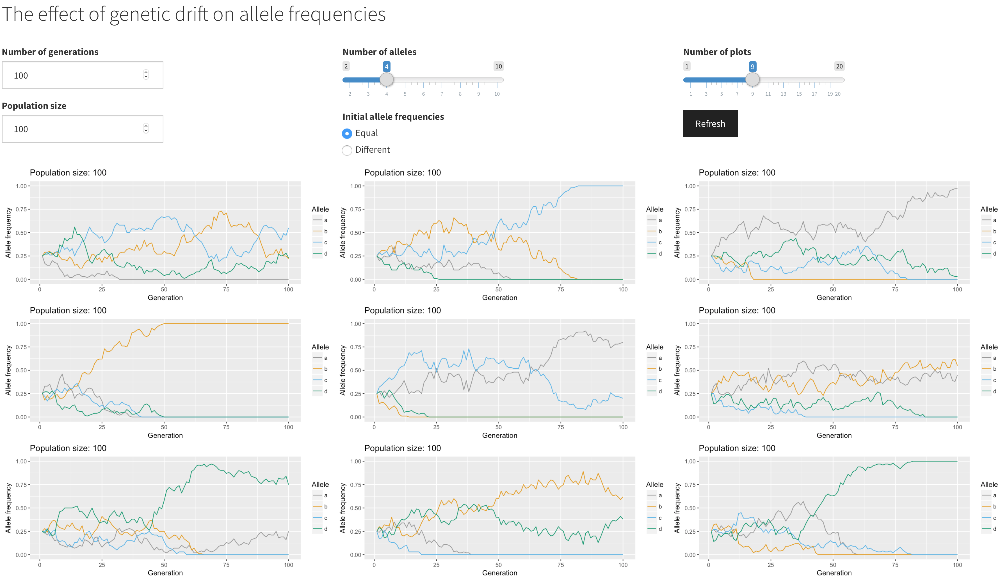

# _Genetic_Drift

Simulates the effect of genetic drift on allele frequencies in a finite population with a Shiny app.

Just open the Rproject in RStudio, open either `ui.R` or `server.R` and click on the `Run App` button.

